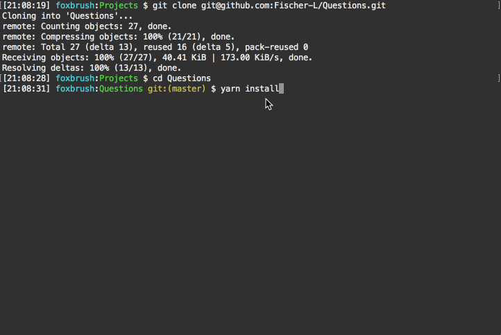

# Questions

## Files

* The questions.js contains the solutions for the 5 questions
* The questions.test.js tests the questions.js

## If you want to test
1. Install nodejs and yarn(optional).

2. Clone this repo and then navigate into the repo directory.

3. Run `npm install` or `yarn install`(if prefer and installed yarn).

4. Run `npm test` or `yarn test`(if prefer and installed yarn).

5. See the test results.

6. This test is simple and should run. In case you aren't able to run the test. Here is this example's environment:
    - MAC OS 10.12.6
    - node v9.4.0
    - yarn 1.3.2
    - npm 5.6.0

7. The questions.test.js is based on Jest. Please refer to the Jest api[1] if want to modify the test. 

    [1] https://facebook.github.io/jest/docs/en/api.html
